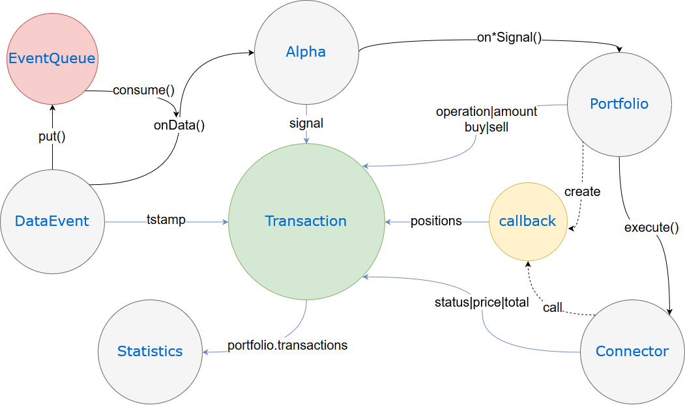

# presso
Event-driven backtest/realtime quantitative trading system.

## Architecture


### DataEvent
- *Raw Data -> DataEvent*

DataEvents process raw data and generate events. Raw data can be news, history price, market data, etc. A DataEvent is a numpy array and its first value must be a timestamp. It will be put into a priority queue with the timestamp so all history events for backtesting are ordered by time.

### Alpha
- *DataEvent -> Signal (A value from -1 to 1)*

Alphas represent trading strategies. An Alpha subscribes to a `main_dataevent` and has access to other DataEvents. It is triggered when its `main_dataevent` sends out a new data event. It processes data and calculates a signal which is sent to a handler in Portfolio.

### Portfolio
- *Signals -> Transactions*

Portfolio is a combination of Alphas. It opens orders according to the signals received, and then sends them to Connectors. It also holds current positions and a list of Transactions.

### Connector
- *Transaction -> Execute*

Connectors are order executors. A Connector could be an API wrapper of an exchange or a simulator using history data.

### Statistics
- *Transactions -> Statistics*

Statistics are triggered at the end of program. They will collect information from Transactions and save data, generate visual charts, calculate ratios, etc.

#### Transaction
Transactions are records that store information through the pipeline. A Transaction is filled by different modules and stored in Portfolio. 

#### EventQueue
EventQueue contains a priority queue and a locking system. DataEvents put events into the EventQueue and wait for its event to be consumed. There will be only one event in EventQueue for every DataEvent, so that all history events are triggered by time.

#### Manifest
Manifest is a TOML file that defines the structure of a Portfolio and dependencies of modules.

## Install and Run
    git clone https://github.com/wynfred/presso.git
    cd presso
    sudo pip3 install .
    presso run example/manifest.toml
    # Press ENTER to stop DataEvents and run Statistics
    # Check presso.log for logs

## Dependencies
    python3.6
    aiohttp
    ccxt
    numpy
    toml

## Examples

### Alpha
```
from presso.core.abstract.alpha import AbstractAlpha


class ExampleAlpha(AbstractAlpha):
    def _init(self):
        # TODO
        pass

    async def _calcSignal(self, data):
        # TODO
        pass

    @property
    def name(self):
        return 'Example'
```

### DataEvent
```
from presso.core.abstract.dataevent import AbstractDataEvent


class ExampleDataEvent(AbstractDataEvent):
    def _init(self):
        # TODO
        pass

    async def _iter(self):
        # TODO
        pass
```

### Portfolio
```
from presso.core.abstract.portfolio import AbstractPortfolio


class ExamplePortfolio(AbstractPortfolio):
    def _init(self):
        # TODO
        self._positions[TICKER.USD] = 100000
        self._positions[TICKER.BTC] = 0

    def onExampleSignal(self, transaction):
        # TODO
        if transaction.signal > 0 and self._positions[TICKER.USD] > 0:
            transaction.buy = TICKER.BTC
            transaction.sell = TICKER.USD
            transaction.total = self._positions[TICKER.USD] * 0.5
            transaction.operation = OPERATION.MARKET
        self._execute(self._connectors['kline_history'], transaction)
```

### Connector
```
from presso.core.abstract.connector import AbstractConnector


class ExampleConnector(AbstractConnector):
    def _init(self):
        # TODO
        pass

    async def execute(self, transaction):
        # TODO
        pass
```

### Statistics
```
from presso.core.abstract.statistics import AbstractStatistics


class ExampleStatistics(AbstractStatistics):
    def _init(self):
        # TODO
        pass

    def onTransaction(self, transaction):
        # TODO
        pass

    def finish(self):
        # TODO
        pass
```
